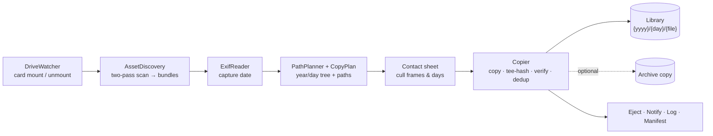

<div align="center">


<p><strong>Get photos off a memory card into a date-organized library — every byte hash-verified, duplicates skipped, nothing overwritten.</strong></p>

<p>
  
  
  
  
  
</p>

</div>

PhotoDrop is a native macOS app for the one moment that should never be lossy: pulling irreplaceable photos off a card. Insert a card, preview the year/day folder tree it will build, optionally cull frames on a contact sheet, then copy each shot with streaming hash verification, content-based deduplication, an optional second archival copy, and an optional eject. A warm hash cache makes re-ingesting the same card against the same library nearly instant.

It is a Swift/SwiftUI port of [PhotoDrop](https://github.com/tsvb/PhotoDrop), a Windows (.NET/WPF) app. The Windows core stays the behavioral source of truth for discovery, deduplication, and path planning — much of the logic here deliberately mirrors it.

## Contents

- [Overview](#overview)
- [Highlights](#highlights)
- [How it works](#how-it-works)
- [Supported formats](#supported-formats)
- [Build and run](#build-and-run)
- [Usage](#usage)
- [Settings](#settings)
- [Naming templates](#naming-templates)
- [Themes](#themes)
- [Architecture](#architecture)
- [Project layout](#project-layout)
- [Signing and sandbox](#signing-and-sandbox)
- [Testing](#testing)
- [Credits](#credits)
- [License](#license)

## Overview

The app watches for removable cards, scans them into **asset bundles** (a primary photo plus its companions), groups those bundles by capture date into a `year / day` folder tree, and copies them to a destination you choose — verifying every file with a streaming [xxHash](https://github.com/Cyan4973/xxHash) as it goes. Files that already exist anywhere under the destination are detected by content and skipped. If anything in a bundle fails, that bundle is rolled back so a RAW never lands without its edits.

The whole flow is built to be trustworthy and legible: it tells you what was preserved before what failed, surfaces the verification hash of every file in the log, leaves a manifest receipt you can re-verify later, and ends on a plain "safe to remove."

## Highlights

| Feature | What it does |
| --- | --- |
| **Date-organized library** | Groups every shot into `{year}/{day}/` folders by EXIF capture date, with fully configurable folder and filename templates. |
| **RAW + companion bundles** | A RAW and its sidecars (`.xmp` / `.dop` / `.pp3`), JPEG pair, and camera audio note (`.wav`) move as one atomic unit — edits never get separated from their RAW. |
| **Streaming verification** | Each file is read once and hashed in flight (tee-hashing); the copy is byte-verified against the source before it counts as done. |
| **Verification receipts** | Every ingest writes a manifest (JSON + CSV) of each file and its xxHash into a `PhotoDrop Manifests/` folder beside the photos — an exportable, chain-of-custody record of exactly what landed. |
| **Library re-verify** | Point at a library (or a single manifest) and re-hash every recorded file to surface silent corruption (bit-rot) or anything gone missing — long after the original ingest. |
| **Content-based dedup** | A file already present anywhere under the destination — even renamed by an earlier import — is detected by size + hash and skipped. |
| **Dual-destination archival** | Optionally write a second, independently verified copy to an archive location in the same pass. |
| **Contact-sheet culling** | Preview thumbnails in a grid and deselect individual frames or whole days before ingesting. |
| **Warm hash cache** | Re-ingesting the same card against the same library skips the slow card reads entirely — a stat-bound operation instead of a read-bound one. |
| **Card-aware menu bar** | A menu bar item detects card arrival, can auto-open the window, and offers optional one-click ingest with your saved defaults. |
| **Eject + notify when done** | Optionally eject the card and post a Notification Center banner on completion when the app isn't frontmost. |
| **Three committed themes** | Steady, Ledger, and Pressroom — each a full identity (appearance, type, accent, and a distinct verification mark), not just an accent color. |

## How it works

Data flows through a chain of mostly-pure value-type transforms driven by a few `@MainActor @Observable` controllers:



1. **`DriveWatcher`** observes `NSWorkspace` mount/unmount events and surfaces the cards that are present.
2. **`AssetDiscovery`** does a two-pass directory walk: RAW primaries and their same-directory companions first, then standalone JPEGs not already claimed as a RAW's JPEG pair. Companion matching is same-directory only, by design.
3. **`ExifReader`** reads `DateTimeOriginal` (or `Digitized`) via ImageIO in the local time zone, falling back to file modification time. This date drives all folder grouping.
4. **`PathPlanner`** groups bundles into the preview tree; **`CopyPlan`** computes the real destination path and filename for each bundle from your templates.
5. **`Copier`** builds a per-destination dedup index, then for each file: dedup-check → copy + tee-hash → verify → record the hash. A verification mismatch halts the job; any other per-bundle error is logged and the job continues. On success it optionally ejects the card, writes a log and a **verification manifest** (the receipt of every file and its hash), and persists the hash cache.

The unit that everything operates on is the **`AssetBundle`** — one primary photo plus its companions. Copy, verify, rollback, and dedup all act on whole bundles, because a RAW without its `.dop` has lost its edits.

Separately from ingest, **Verify Library** (in the toolbar) re-hashes an existing library against the manifests it wrote and reports anything changed or missing — so you can re-check an archive for bit-rot long after the photos landed.

## Supported formats

**RAW (primaries)** — `dng`, `raf`, `arw`, `cr2`, `cr3`, `nef`, `nrw`, `orf`, `rw2`, `pef`, `srw`, `3fr`, `rwl`, `x3f`, `erf`, `mrw`, `mef`, `iiq`, `raw`, `sr2`, `srf`, `dcr`, `kdc`, `mos` — covering Canon, Nikon, Sony, Fujifilm, Panasonic, Olympus/OM, Pentax, Leica, Sigma, Phase One, Hasselblad, Kodak, and more.

**JPEG** — `jpg`, `jpeg`. A JPEG is a companion when a same-stem RAW lives beside it, otherwise it's a primary bundle of its own.

**Companions** — Adobe / DxO / RawTherapee sidecars (`xmp`, `dop`, `pp3`) and camera audio notes (`wav`). Both naming shapes are recognized: long-form `IMG_1234.DNG.xmp` and short-form `IMG_1234.xmp`. Orphan sidecars (a sidecar with no primary) are ignored.

## Build and run

**Prerequisites**

- macOS 14.0 or later and Xcode 16+ (Swift 6 toolchain).
- [XcodeGen](https://github.com/yonaskolb/XcodeGen) — `brew install xcodegen`.

The `.xcodeproj` is **generated and gitignored**, so you regenerate it on a fresh checkout and after any change to `project.yml` or the source file list:

```bash
git clone https://github.com/tsvb/PhotoDropMac.git
cd PhotoDropMac

xcodegen generate          # generate PhotoDropMac.xcodeproj from project.yml
open PhotoDropMac.xcodeproj # then press ⌘R in Xcode to build & run
```

Or build straight from the command line:

```bash
xcodebuild -project PhotoDropMac.xcodeproj -scheme PhotoDropMac \
           -configuration Debug -destination 'platform=macOS' build
```

There is a single application target and scheme, `PhotoDropMac`.

## Usage

1. **Insert a card.** PhotoDrop detects it and (optionally) opens the window automatically.
2. **Review the preview.** The sidebar shows the years and days that will be created; switch the toolbar to the contact sheet to inspect thumbnails and deselect any frames or days you don't want.
3. **Choose a destination** in the inspector — and optionally an archive folder for a verified second copy. PhotoDrop remembers your destinations for every future card.
4. **Ingest.** If a destination looks too full for the selected shots, PhotoDrop warns first (you can still proceed). Files then copy with a live progress pane; the activity log streams each file with its verification signature as it lands.
5. **Done.** On a clean run the completion summary reports what was copied, what was already present, throughput, and — if you enabled eject — that the card is safe to remove.

## Settings

Preferences are plain `@AppStorage` keys (no central store). Defaults:

| Key | Type | Default | Controls |
| --- | --- | --- | --- |
| `photodrop.primaryDestination` | String | — | Primary library folder. |
| `photodrop.archiveDestination` | String | — | Optional second copy, verified independently. |
| `photodrop.verifyCopies` | Bool | `true` | Hash-verify every file after copy. |
| `photodrop.ejectAfterIngest` | Bool | `false` | Eject the card when the job finishes. |
| `photodrop.showCompletionSheet` | Bool | `true` | Show the completion summary sheet. |
| `photodrop.notifyOnCompletion` | Bool | `true` | Post a Notification Center banner on finish when the app isn't frontmost. |
| `photodrop.template.folder` | String | `{yyyy-MM-dd}[_{Description}]` | Day-folder name template. |
| `photodrop.template.filename` | String | `{yyyyMMdd_HHmmss}_{OriginalStem}` | Primary filename template (extension auto-appended). |
| `photodrop.verificationStyle` | enum | `steady` | App theme (Steady / Ledger / Pressroom). |
| `photodrop.menuBar.visibility` | enum | `always` | Menu bar item: Always / With card / Hidden. |
| `photodrop.menuBar.autoOpenWindow` | Bool | `true` | Open the window when a card arrives. |
| `photodrop.menuBar.oneClickIngest` | Bool | `false` | One-click ingest from the menu bar using saved defaults. |

## Naming templates

The destination layout is always `{root}/{yyyy}/{day-folder}/{filename}.{ext}` — the year is the fixed top level and the original extension is always re-appended. The **day-folder** and **filename** are templates you control in Settings → Naming.

Template syntax:

- `{…}` — a token. A known name (`Description`, `OriginalName`, `OriginalStem`, `CardLabel`) renders that value; anything else is treated as a Unicode date-format pattern applied to the capture date (so `{yyyy}`, `{yyyy-MM-dd}`, `{HHmmss}` all work).
- `[…]` — an optional group, dropped entirely when a named token inside it renders empty (e.g. when you've typed no description).

With the defaults and a description of "Iceland", a Fujifilm frame from May 30, 2026 lands at:

```text
~/Pictures/Library/2026/2026-05-30_Iceland/20260530_142233_DSCF1234.RAF
```

Companions are renamed to track the primary's new name, so the stem relationship survives the move.

## Themes

`photodrop.verificationStyle` selects an app-wide theme. Each one commits to a full look — appearance, typography, accent, and its own verification mark — rather than just recoloring the app:

| Theme | Appearance | Type | Accent |
| --- | --- | --- | --- |
| **Steady** | follows system (light/dark) | SF Pro (system) | your macOS accent |
| **Ledger** | forced light — "paper" | serif |  `#120A8F` |
| **Pressroom** | forced dark — "wire desk" | monospaced |  `#E89E29` |

The verification mark differs per theme too: Steady uses the mechanical **seal grid** that fills as bundles verify (the motif in the banner above), Ledger a **wax-seal stamp** ring, and Pressroom an **aperture iris**.

## Architecture

Swift 6 strict concurrency is on, with a deliberate split:

- **UI state** lives in `@MainActor @Observable` controllers — `DriveWatcher`, `IngestPlanner`, `Copier`, `Verifier`.
- **Heavy work** (directory scans, hashing, copying, dedup-index builds) runs on detached tasks and hops results back to the main actor; progress is throttled to avoid flooding the UI.
- **Shared mutable state** is confined to an `actor` (`HashCache`). Domain models are value types and therefore `Sendable`.

A few design choices worth knowing:

- **Tee-hashing** streams source → destination in 1 MiB chunks while hashing in flight, so a multi-GB file is read exactly once for both the copy and its digest.
- **Dedup is content-based**, matching the Windows reference: a file is a duplicate if its size and hash match anywhere under the destination root, not just at the same path.
- **Bundles are all-or-nothing.** A failure mid-bundle deletes that bundle's already-written files. A verification mismatch halts the whole job; other errors are logged and the run continues.
- The `XxHash64` implementation is a pure-Swift, value-type streaming XXH64 — non-cryptographic, used only for copy verification and dedup equality.

State is persisted in the user's Library: the hash cache at `~/Library/Application Support/PhotoDropMac/hash-cache.json`, and per-job logs at `~/Library/Logs/PhotoDrop/`. Each ingest also writes a verification manifest (JSON + CSV) into a `PhotoDrop Manifests/` folder at the destination root, so the receipt travels with the photos.

## Project layout

```text
PhotoDropMac/
├─ project.yml                 # XcodeGen spec (the .xcodeproj is generated)
├─ CLAUDE.md                   # in-repo guide to the codebase
├─ HANDOFF_FROM_WINDOWS.md     # context from the Windows → Mac port
├─ docs/
│  └─ design_handoff_polish_pass/   # design spec, copy, and an HTML prototype
└─ Sources/PhotoDropMac/
   ├─ PhotoDropMacApp.swift · AppCoordinator.swift      # app entry, scenes, menu bar
   ├─ DriveWatcher.swift · DriveEjector.swift           # card detection & eject
   ├─ AssetBundle.swift · AssetDiscovery.swift · ExifReader.swift   # scan & model
   ├─ PathPlanner.swift · CopyPlan.swift · NamingTemplate.swift     # path planning
   ├─ IngestPlanner.swift · PreflightCheck.swift        # orchestration & free-space check
   ├─ Copier.swift · FileCopier.swift · DestinationIndex.swift      # copy engine & dedup
   ├─ Hasher.swift · HashCache.swift · JobLogger.swift · Manifest.swift   # xxHash, cache, logs, receipts
   ├─ MainView.swift · PreviewTree.swift · ContactSheet.swift · ThumbnailLoader.swift
   ├─ InspectorPane.swift · ProgressPane.swift · CompletionSheet.swift · SettingsView.swift
   ├─ Verifier.swift · VerifySheet.swift                # library re-verification
   ├─ VerificationStyle+Theme.swift                     # the three themes
   ├─ SealGrid.swift · StampMark.swift · ApertureMark.swift · VerifiedSignature.swift  # marks
   └─ Notifier.swift                                    # completion notifications
```

## Signing and sandbox

The app is intentionally **unsandboxed**, ad-hoc signed (`CODE_SIGN_IDENTITY = "-"`), with the hardened runtime off. It needs unrestricted filesystem access (any card → any destination) and shells out to `/usr/sbin/diskutil` to eject cards — which the unsandboxed/ad-hoc setup allows without entitlements. Adding the sandbox entitlement would require rethinking both eject and folder access.

## Testing

There is no XCTest target. The one automated check is a DEBUG-only self-test of the hash implementation — `XxHash64Vectors.validated` (entry point `xxHash64SelfCheck()` in `Hasher.swift`), which asserts XXH64 reference vectors and streaming-split correctness. Assertions fire only in Debug builds; run a Debug build or call `xxHash64SelfCheck()` early in launch to exercise it.

## Credits

A native Swift/SwiftUI port of [tsvb/PhotoDrop](https://github.com/tsvb/PhotoDrop) (.NET/WPF, Windows), whose core logic remains the behavioral reference. Built with SwiftUI and ImageIO; project files are generated with [XcodeGen](https://github.com/yonaskolb/XcodeGen). The xxHash algorithm is by [Yann Collet](https://github.com/Cyan4973/xxHash) (reimplemented here in pure Swift).

## License

PhotoDrop is released under the [MIT License](LICENSE) — © 2026 tsvb. You're free to use, modify, and distribute it, including commercially, as long as the copyright notice and license text are included.
